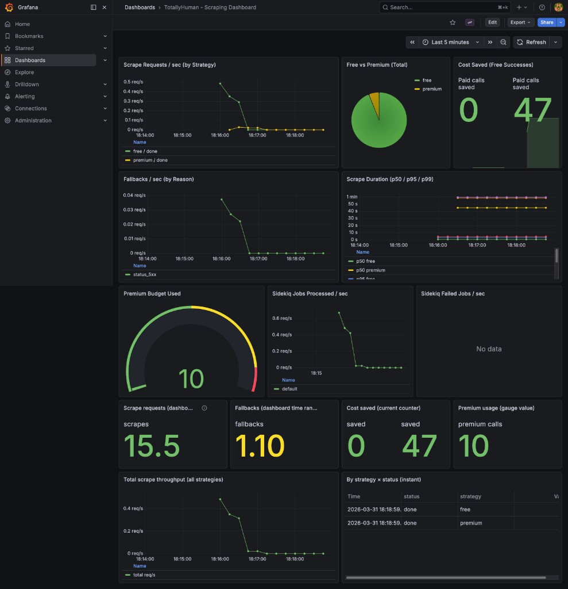

# TotallyHuman

A fault-tolerant, cost-aware web scraping infrastructure that looks like a real browser to target websites. Submit a URL, get back clean data — free TLS-spoofed path first, paid API fallback with budget caps, and full Prometheus/Grafana observability.

## The Problem

Modern websites detect and block automated scrapers by inspecting the TLS fingerprint of incoming connections. Standard HTTP libraries (`requests`, `Net::HTTP`, `curl`) produce fingerprints that scream "bot" — they get flagged instantly with 403s, CAPTCHAs, or empty responses.

**TotallyHuman** solves this with a two-tier strategy:

1. **Free path** — A Python sidecar (`curl_cffi`) impersonates Chrome's TLS handshake at the protocol level, passing fingerprint checks without a real browser.
2. **Paid fallback** — When the free path fails (403, 429, 5xx), a premium scraping API (ScrapingBee) kicks in automatically, with Redis-backed budget caps to prevent runaway spend.

## Architecture

```
Client
  │
  ▼
┌─────────────────────────────────────────────────────────────┐
│  Docker Compose                                             │
│                                                             │
│  Rails API (:3000)                                          │
│    ├── POST /scrape_jobs ─── create job ──► MongoDB         │
│    │                         enqueue   ──► Redis/Sidekiq    │
│    └── GET  /scrape_jobs/:id ◄── poll result ── MongoDB     │
│                                                             │
│  ScrapeWorker (Sidekiq)                                     │
│    └── ScraperStrategy                                      │
│          ├─ 1. MaskServiceClient ──► Mask Service (:8000)   │
│          │     curl_cffi (Chrome TLS)  ──► Target Website   │
│          └─ 2. ScraperApiClient  ──► ScrapingBee (fallback) │
│               Redis budget check                            │
│                                                             │
│  Prometheus (:9090) ◄── scrapes ── API + Worker /metrics    │
│  Grafana   (:3001) ◄── queries ── Prometheus                │
└─────────────────────────────────────────────────────────────┘
```

See [ARCHITECTURE.md](ARCHITECTURE.md) for detailed Mermaid diagrams and sequence flows.

## Tech Stack

| Layer           | Technology                    | Why                                                                 |
| --------------- | ----------------------------- | ------------------------------------------------------------------- |
| API             | Rails 8 (API-only)            | Convention-driven, rapid development, great ecosystem               |
| Background Jobs | Sidekiq + Redis               | Battle-tested, retries, concurrency                                 |
| TLS Spoofing    | Python FastAPI + curl_cffi    | Only reliable way to impersonate browser TLS without a full browser |
| Database        | MongoDB (Mongoid)             | Flexible schema for scrape results of varying shapes                |
| Budget Tracking | Redis                         | Atomic Lua scripts for race-safe budget guards                      |
| Observability   | Yabeda + Prometheus + Grafana | Application metrics, scraping dashboards, cost visibility           |

## Quick Start

```bash
# Clone and start everything
git clone <repo-url> && cd totally-human
docker compose up --build
```

That's it. Seven services come up: `api`, `worker`, `mask-service`, `mongo`, `redis`, `prometheus`, `grafana`.

### Create a scrape job

```bash
curl -s -X POST http://localhost:3000/scrape_jobs \
  -H "Content-Type: application/json" \
  -d '{"url": "https://example.com"}' | jq
```

```json
{
  "id": "683a1f...",
  "url": "https://example.com",
  "status": "pending",
  "created_at": "2026-02-14T..."
}
```

### Poll for results

```bash
curl -s http://localhost:3000/scrape_jobs/<id> | jq '.status, .response_body.strategy'
```

```
"done"
"free"
```

### List all jobs

```bash
curl -s http://localhost:3000/scrape_jobs | jq '.[].status'
```

## Demo (Phase 9)

Two ways to show the pipeline in under two minutes:

### A. Live scrape batch (`demo:run`)

Requires **`api`**, **`worker`**, **`mask-service`**, **`mongo`**, and **`redis`** up.

```bash
docker compose up --build -d
# From the host (same machine as published port 3000):
docker compose exec api bundle exec rake demo:run
```

Override the API base if needed (e.g. custom port):

```bash
docker compose exec -e DEMO_API_URL=http://127.0.0.1:3000 api bundle exec rake demo:run
```

The task **POSTs** five URLs (Hacker News, Python docs article, Amazon SERP, Amazon PDP, Google SERP), **polls** each job, then prints a **colored summary** (status, **free/premium** strategy, **parser_used**, and a short preview of structured fields). A final block shows **wall time**, **success rate**, and parser/strategy counts.

**Example lines (shape only — live results depend on targets and anti-bot):**

```
TotallyHuman demo — submitting 5 jobs to http://127.0.0.1:3000
  enqueued  Hacker News  id=...
  …
Hacker News | done | 3.2s | strategy=free | parser=HackerNewsParser | stories=30
…
— Summary —
  Wall time:     18.5s
  Jobs:          5 (4 done, 1 failed/timeout)
  Success rate:  80% (of terminal outcomes)
  Strategies:    {"free"=>3, "premium"=>1}
  Parsers:       {"HackerNewsParser"=>1, "AmazonSearchParser"=>1, ...}
```

Some URLs may **fail** or return **robot checks** / empty parsers depending on the live site — that is expected and is useful to explain in interviews.

### B. Instant API browsing (`demo:seed`)

Inserts **completed** jobs with realistic **`parsed_data`** (no worker). **Development only**, unless `ALLOW_DEMO_SEED=true`.

```bash
docker compose exec api bundle exec rake demo:seed
curl -s http://localhost:3000/scrape_jobs | jq '.[].parser_used'
```

Seeded rows have **`demo_seed: true`**; re-run **`demo:seed`** to replace them.

### Grafana after a live demo



Open **[http://localhost:3001](http://localhost:3001)** (default `admin` / `admin`). After **`demo:run`** or **`demo:load`**, allow ~15s for **Prometheus** to scrape **`/metrics`** before panels move. For a moving demo, use **`demo:load`** (see below) or record **asciinema** / a terminal GIF alongside this dashboard.

Rehearsal bullets: **[INTERVIEW_NOTES.md](INTERVIEW_NOTES.md)**.

### Populate Grafana (many jobs, fast)

Scrape metrics (`totallyhuman_*`) are exported from the **Sidekiq worker**. To make the dashboard look “alive”, enqueue a batch of jobs (rotates URLs across HN, `example.com`, Wikipedia, Google SERP, Amazon SERP/PDP so rate limits spread across domains):

```bash
docker compose up -d   # api + worker + mask + mongo + redis + prometheus + grafana
```

**Light load (~60 jobs, default):**

```bash
docker compose exec api bundle exec rake demo:load
```

**Heavier load:**

```bash
docker compose exec -e DEMO_LOAD_COUNT=200 -e DEMO_LOAD_SLEEP_MS=20 api bundle exec rake demo:load
```

**Maximum burst (watch Amazon rate limits and premium budget):**

```bash
docker compose exec -e DEMO_LOAD_COUNT=500 -e DEMO_LOAD_SLEEP_MS=0 api bundle exec rake demo:load
```

Use `DEMO_LOAD_SLEEP_MS=0` only if you want a tight burst; Sidekiq + **RateLimiter** will still serialize per domain.

**Run the full scripted demo five times in a row** (polls each batch — slower, but diverse):

```bash
for i in 1 2 3 4 5; do docker compose exec api bundle exec rake demo:run; echo "--- round $i done ---"; sleep 3; done
```

**Plain `curl` loop** (host has port 3000 published):

```bash
for i in $(seq 1 100); do
  curl -sS -o /dev/null -X POST http://localhost:3000/scrape_jobs \
    -H "Content-Type: application/json" \
    -d '{"url": "https://example.com/"}' || true
  sleep 0.05
done
```

(Adjust URLs to valid ones from your registry; invalid URLs return 422.)

Then open **Grafana** → **TotallyHuman - Scraping Dashboard**. Default time range is **Last 1 hour**. Prometheus scrapes every **15s**, so wait **30–60s** after loading before expecting smooth `rate()` graphs. If you changed `grafana/provisioning/dashboards/totallyhuman.json`, restart Grafana or re-import the dashboard so new panels appear:

```bash
docker compose up -d --force-recreate grafana
```

## API Reference

| Method | Path               | Description                                               |
| ------ | ------------------ | --------------------------------------------------------- |
| `POST` | `/scrape_jobs`     | Create a new scrape job. Body: `{ "url": "https://..." }` |
| `GET`  | `/scrape_jobs/:id` | Get job status and response data                          |
| `GET`  | `/scrape_jobs`     | List recent jobs (last 100, newest first)                 |
| `GET`  | `/up`              | Rails health check                                        |
| `GET`  | `/metrics`         | Prometheus metrics endpoint                               |

### Response Fields

| Field                    | Type    | Description                                      |
| ------------------------ | ------- | ------------------------------------------------ |
| `status`                 | string  | `pending`, `done`, or `failed`                   |
| `response_body.status`   | integer | HTTP status code from target                     |
| `response_body.html`     | string  | Raw HTML from target (truncated at 100K chars)   |
| `response_body.strategy` | string  | `free` (mask-service) or `premium` (ScrapingBee) |
| `response_body.error`    | boolean | Whether the scrape encountered an error          |

## Cost Optimization

The `ScraperStrategy` implements a tiered approach:

1. **Always try free first** — `MaskServiceClient` calls the Python sidecar which uses `curl_cffi` with `impersonate="chrome120"` to produce a genuine Chrome TLS fingerprint.

2. **Fallback triggers** — If the free path returns `403`, `429`, any `5xx`, a network error, or the `error` flag, the strategy automatically falls back.

3. **Budget-guarded premium** — Before calling ScrapingBee, an atomic Redis Lua script checks if `premium_usage < PREMIUM_BUDGET_LIMIT` (default: 1000). If exceeded, the job fails with `BudgetExceededError` instead of silently spending money.

4. **Graceful degradation** — If Redis is unavailable, a `MockRedis` allows scraping to continue (budget tracking is disabled and logged).

Every scrape records which strategy was used in the response, so you always know what path your data took.

## Observability

Open **Grafana** at [http://localhost:3001](http://localhost:3001) (admin/admin).

The auto-provisioned **TotallyHuman** dashboard includes 8 panels:

| Panel                         | What it shows                                              |
| ----------------------------- | ---------------------------------------------------------- |
| Scrape Requests / sec         | Rate of scrapes by strategy (free vs premium)              |
| Fallbacks / sec               | Rate of fallbacks by reason (403, 429, 5xx, network_error) |
| Scrape Duration (p50/p95/p99) | Latency distribution by strategy                           |
| Cost Saved                    | Counter of free-path successes (premium calls avoided)     |
| Premium Budget Used           | Current premium API usage vs limit                         |
| Active Scrapes                | Gauge of in-flight scrapes                                 |
| Sidekiq Jobs Processed / sec  | Background job throughput                                  |
| Sidekiq Failed Jobs / sec     | Background job failure rate                                |

### Metrics Architecture

- **Rails API** exposes metrics at `/metrics` (port 3000), powered by `yabeda-prometheus`.
- **Sidekiq worker** runs a dedicated WEBrick server on port 9394, exposing the same Yabeda metrics from the worker process.
- **Prometheus** scrapes both endpoints every 15 seconds.
- **Grafana** queries Prometheus with auto-provisioned datasource and dashboard.

## Testing

Tests run inside Docker (the production Ruby version matches):

```bash
docker compose run --rm -u root \
  -e BUNDLE_WITHOUT="" \
  -e RAILS_ENV=test \
  -e MONGO_URL=mongodb://mongo:27017/totally_human_test \
  api bash -c "bundle install --quiet && bundle exec rspec"
```

### Test Suite (39 specs)

| File                                        | Coverage                                                                                             |
| ------------------------------------------- | ---------------------------------------------------------------------------------------------------- |
| `spec/services/mask_service_client_spec.rb` | Success, proxy forwarding, timeout, network error, malformed JSON                                    |
| `spec/services/scraper_api_client_spec.rb`  | Success, missing API key, budget exceeded (402), 4xx errors, timeout                                 |
| `spec/services/scraper_strategy_spec.rb`    | Free success, fallback on 403/429/5xx/error, both fail, budget exceeded, Redis down, metric failures |
| `spec/workers/scrape_worker_spec.rb`        | Job completion, failure marking, missing job, strategy delegation                                    |
| `spec/requests/scrape_jobs_spec.rb`         | Create, show, index, validation errors, 404                                                          |

### Linting

```bash
# Ruby
docker compose run --rm -u root -e BUNDLE_WITHOUT="" api bash -c \
  "bundle install --quiet && bundle exec rubocop"

# Python
docker compose run --rm mask-service bash -c \
  "pip install ruff --quiet && ruff check /app/ && ruff format --check /app/"
```

## Project Structure

```
totally-human/
├── app/
│   ├── controllers/
│   │   └── scrape_jobs_controller.rb   # REST API (create, show, index)
│   ├── models/
│   │   └── scrape_job.rb               # Mongoid model (url, status, response_body)
│   ├── services/
│   │   ├── mask_service_client.rb      # HTTP client for Python sidecar
│   │   ├── scraper_api_client.rb       # HTTP client for ScrapingBee
│   │   └── scraper_strategy.rb         # Cost-aware routing (free → premium)
│   └── workers/
│       └── scrape_worker.rb            # Sidekiq job: fetch → persist
├── config/
│   ├── initializers/
│   │   ├── sidekiq.rb                  # Redis config + worker metrics server
│   │   └── yabeda.rb                   # Prometheus metric definitions
│   ├── mongoid.yml                     # MongoDB config (Docker + local)
│   └── routes.rb                       # API routes + /metrics
├── mask_service/
│   ├── main.py                         # FastAPI + curl_cffi TLS spoofing
│   ├── model.py                        # Pydantic request/response models
│   ├── logging_config.py               # Structured logging setup
│   ├── Dockerfile                      # Python 3.11-slim
│   ├── requirements.txt                # fastapi, uvicorn, curl_cffi
│   └── ruff.toml                       # Python linter config
├── lib/
│   ├── demo/                           # Phase 9: Demo::Runner, Seeder, Colors
│   └── tasks/
│       └── demo.rake                   # demo:run, demo:seed
├── spec/                               # RSpec test suite
├── docs/images/                        # README assets (e.g. Grafana screenshot)
├── grafana/provisioning/               # Auto-provisioned datasource + dashboard
├── prometheus.yml                      # Scrape config (api + worker)
├── docker-compose.yml                  # 7 services
├── compose.env                         # Environment variables
├── ARCHITECTURE.md                     # Mermaid diagrams + phase status
├── INTERVIEW_NOTES.md                  # Architecture & interview scripts
└── IMPLEMENTATION_PLAN.md              # Phased build plan (Phases 0–10)
```
